# Create and Perform Policy Review Campaigns

## Introduction

Access Governance Administrators (Pamela Green) can create policy review campaign and Perform Policy Review tasks. 

* Estimated Time: 15 minutes
* Persona: Administrator

### Objectives

In this lab, you will:
* Create policy review campaigns for OCI IAM Policies
* Examine policy review tasks raised by the campaign
* Evaluate policy review tasks assigned to you as a Cloud Administrator

## Task 1: Create a Policy Review Campaign

1.  On the **Oracle Access Governance** console home page, scroll down and select the **“Let’s create some work and define a new campaign”** tile. Alternatively, you can select **Navigation Menu -> Access Reviews -> Campaigns.** On the **Campaigns** page, click the **Create a campaign** button.

  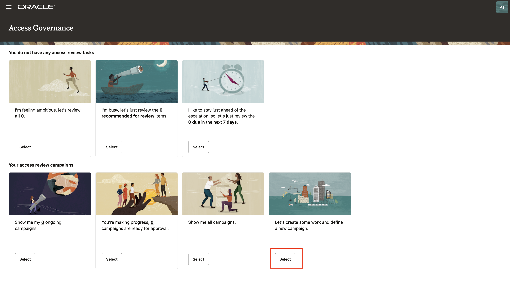

  * In the Selection criteria step, select the **Which cloud providers?** tile. You will see a list of available cloud tenancies.

  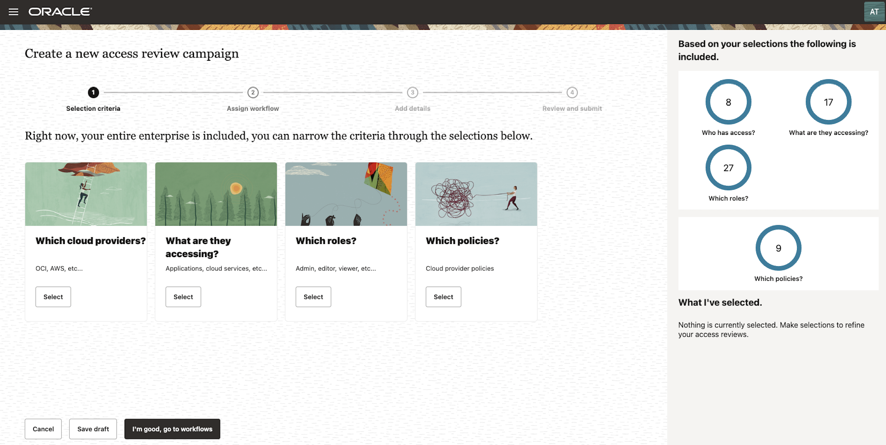

  * Select an appropriate cloud tenancy. In this tutorial, select your cloud tenancy. A green tick is marked against your selection. You can further refine your selection by selecting a specific compartment and a domain, to run domain-specific policy reviews.

  

  * Move on to the next step to select policies that you want to review. Select **Which policies?** tile. You will see a list of available policies in the domain that you selected.

  

  * Select the policies that you want to review. In this tutorial, select the following policies and click **Apply my selections.**

      - tf1-auditors-policy
      - tf2-network-admins-policy
      - tf3-security-admins-policy

    
    

  * Proceed to the **Assign workflow** step. To do this, click **I’m good, go to workflows.** Here, you can define the approval workflow for your review tasks, click **Next.**

  

  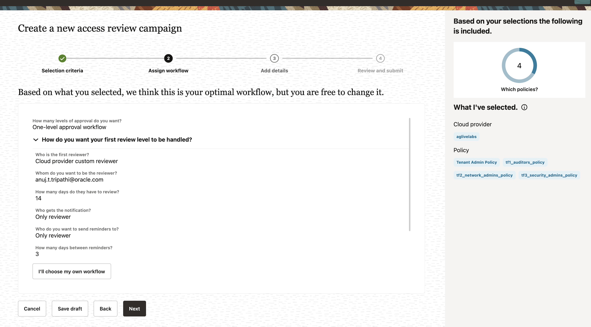

  * In the **Add details** step, you can define the frequency (one-time or periodic) at which to run an access review campaign, give a meaningful name to your campaign, add a supporting description, and assign values to additional attributes, such as who owns it and when the campaign should start or end.

  * For this tutorial make the following changes in the **Add details** step:

      **How often do you want this to run?** : One time

      **What do you want to call this campaign?**: Policy-Review-OCI-IAM

      **How do you want to describe this campaign?**: Policy-Review-OCI-IAM

      **Who owns this campaign?**: Me

      **How would you like to schedule your campaign?** : Run now (will start 10 minutes from creation)

  * Click **Next.**

  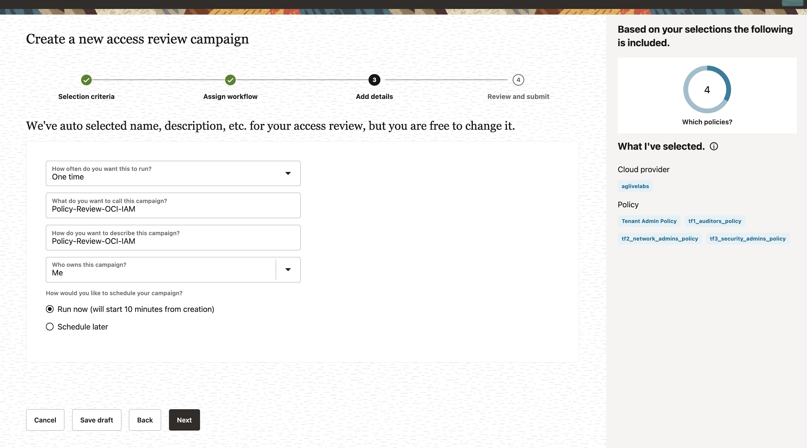

  * The **Review and submit** step displays the information you have added in the previous steps. Select **Create** to create the campaign. Your campaign is scheduled and is displayed on the **Campaigns** page. It will run 10 minutes from creation. 

  

  

## Task 2: Perform Policy Review Tasks

  In this task, you will review and certify OCI IAM review tasks raised by the campaign created in the previous task.

  1. On the Oracle Access Governance Console home page, from the navigation menu, select **Access Reviews -> My Access Reviews.** 

  2. To view review tasks created by your policy review campaign, click the **Policy review tasks** tab. You will see all policy access review tasks assigned to you as a reviewer. Oracle Access Governance uses in-house analytic-based Intelligence system to provide accept/review recommendations.

  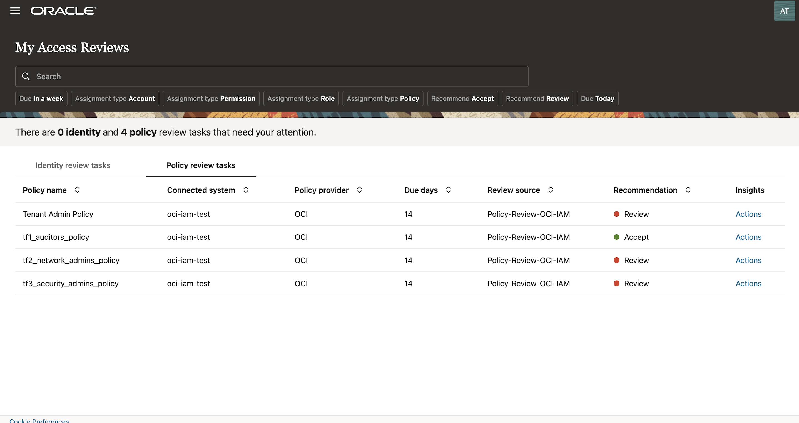

  3. For this tutorial, let’s check the recommendations given by Oracle Access Governance. 

   - tf2-network-admins-policy is marked for Review
   - tf3-security-admins-policy is marked for Review
   - tf1-auditors-policy is marked to Accept

  4. Let’s check out the Insights generated by Oracle Access Governance. For **tf1-auditors-policy**, click the corresponding **Actions** links under the **Insights** column.

  5. On the **Insights** page, you can view our recommendation for the policy review task. On the left-panel, you can view the policy information. On the right, you can view a complete list of actionable and non actionable policy statements, view policy details to see who and what the policy statement is granting access to, and make appropriate decisions on each statement.

    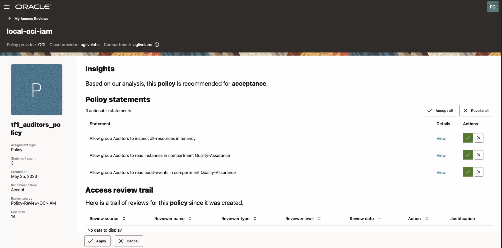

  6. Beside the Policy statement, click on the view button to view the resources associated with the policies. Click on Summmary and Details to view the information. Click Close. 

     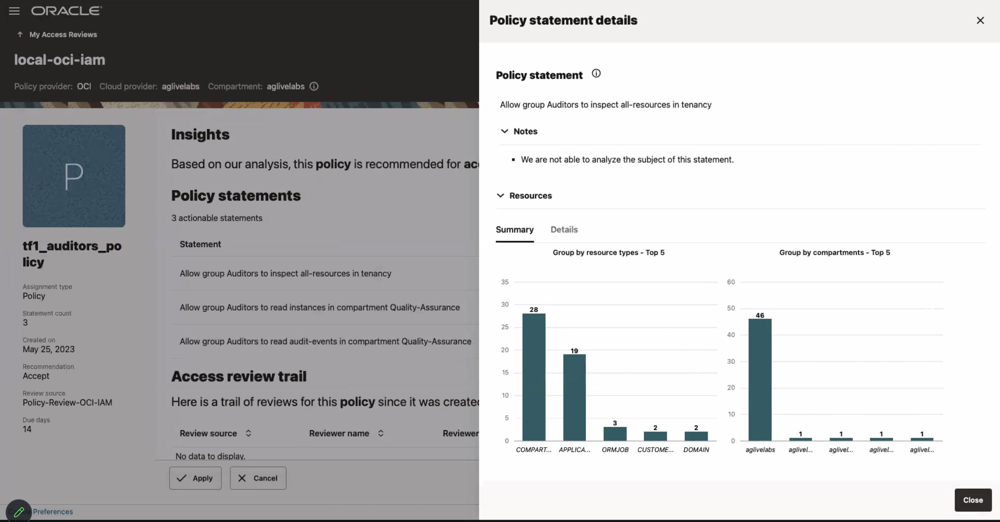

     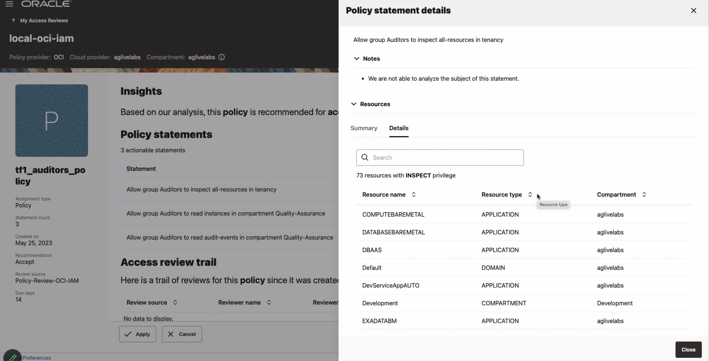

  7. To make a review decision, you can either revoke all or accept all actionable statements in that policy at once, or make decision individually on each policy statement. For this tutorial, let us validate 2 usecases:

    **Usecase 1:**  Revoke policy statement from a policy - **tf1-auditors-policy**

      - Let’s revoke the policy statement **Allow group Auditors to read audit-events in compartment Quality-Assurance** from the policy  **tf1-auditors-policy**. 

      

      - Click on the cross button under Actions column for the policy statement **Allow group Auditors to read audit-events in compartment Quality-Assurance**

      

      - Click on **Apply**

      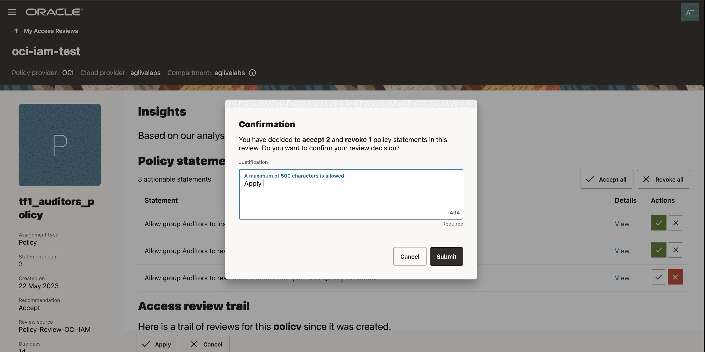

      -  Enter justification for why you revoke the access review items and accept the remaining items then click on **Submit** This will trigger the auto-remediation process in the Oracle Access Governance system.

      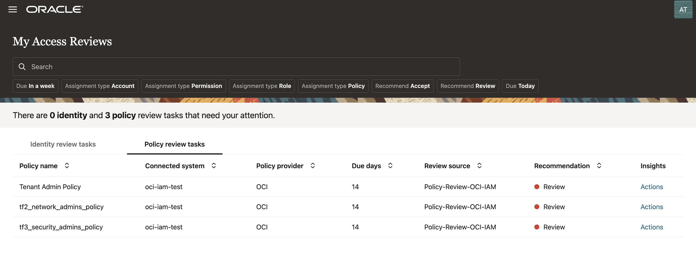

    **Usecase 2:**  Revoke an entire policy - **tf3-security-admins-policy** 

      - Let's revoke the entire policy **tf3-security-admins-policy** 

       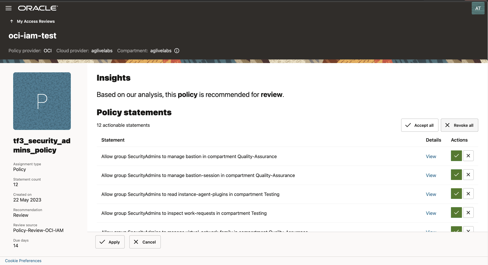

      - Click on the Revoke All button. 

       

      - Click **Apply.** The **Confirmation** dialog box is displayed.

        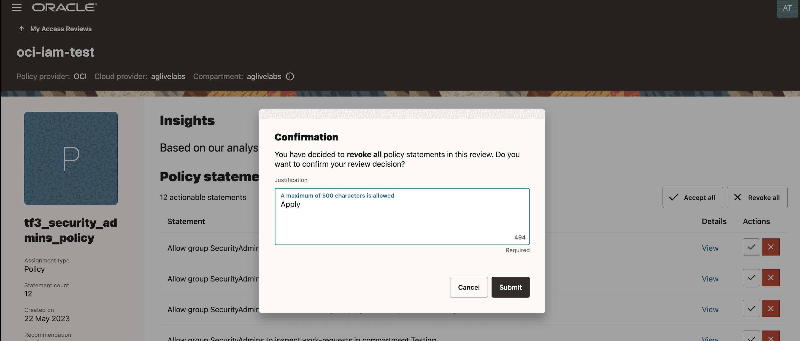

     - Provide justification and then click **Submit.** The closed loop access remediation will take place automatically.

  7. Login to the Identity domain: ag-domain OCI console as the Identity Domain Administrator. Naviagte to Identity & Security -> Identity -> Policies.

  * Verify the entire policy - **tf3-security-admins-policy** has been revoked from the list of policies successfully. 

   Before performing the policy review:

  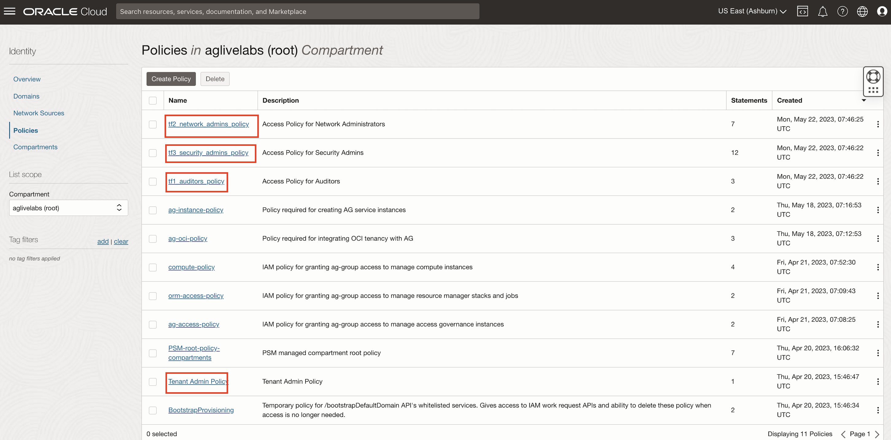
   
   After performing the policy review: 

   

  * Verify the policy statement - **Allow group Auditors to read audit-events in compartment Quality-Assurance** of the policy -  **tf1-auditors-policy** has been revoked successfully. 

  Before performing the policy review:

   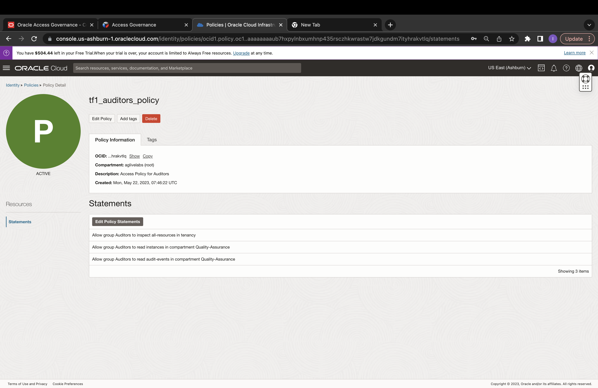
   

  After performing the policy review: 

   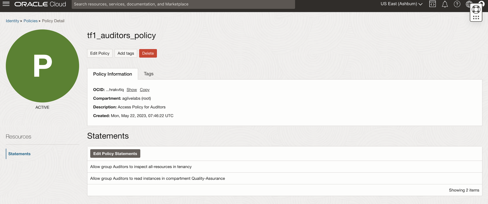

  This concludes the tutorial on create and perform OCI IAM policy reviews.

  You may now **proceed to the next lab**. 

## Learn More

* [Oracle Access Governance Create Access Review Campaign](https://docs.oracle.com/en/cloud/paas/access-governance/pdapg/index.html)
* [Oracle Access Governance Product Page](https://www.oracle.com/security/cloud-security/access-governance/)
* [Oracle Access Governance Product tour](https://www.oracle.com/webfolder/s/quicktours/paas/pt-sec-access-governance/index.html)
* [Oracle Access Governance FAQ](https://www.oracle.com/security/cloud-security/access-governance/faq/)

## Acknowledgments
* **Authors** - Anuj Tripathi, Indira Balasundaram, Anbu Anbarasu 
* **Last Updated By/Date** - Anbu Anbarasu, May 2023
